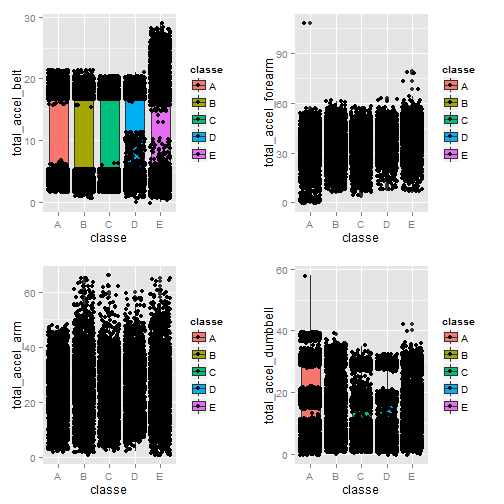

Data Products Project
========================================================
author: Justin Lutz
date: Sun Jun 21 17:33:59 2015

Introduction
========================================================

<small>This presentation covers material that was covered during the Machine Learning course in the Coursera Data Science specialization.

The data derives from the "Wearable Computing: Accelerometers Data Classification of Body Postures and Movements" research (you can get to the link at http://groupware.les.inf.puc-rio.br/har#sbia_paper_section#ixzz3YRDLWxEV).

From the research paper: "Six young health participants were asked to perform one set of 10 repetitions of the Unilateral Dumbbell Biceps Curl in five different fashions: exactly according to the specification (Class A), throwing the elbows to the front (Class B), lifting the dumbbell only halfway (Class C), lowering the dumbbell only halfway (Class D) and throwing the hips to the front (Class E)."
                                                                                                                                                                                                                                                         The goal of this presentation is to show the results of the machine learning model that was developed in the Machine Learning class.</small>

Data Analysis
========================================================


<small>Taking a look at the initial data, you can see a relationship between total acceleration from a sensor and the resulting classification.  For example, for the "E" classification (throwing the hips to the front), there is greater hip acceleration than any other classification.  Other acceleration data from other sensors (forearm, arm, dumbbell) show similar results.  See the boxplots to the right.</small>
***
 


Prediction Model Used
========================================================

<small>The input data was divided into a training set and a testing set.  The training set was then run through the Random Forest training model with 3-fold cross validation.  The resulting model had an in-sample accuracy of over 99%.</small>


```
Random Forest 

14718 samples
   52 predictor
    5 classes: 'A', 'B', 'C', 'D', 'E' 

No pre-processing
Resampling: Cross-Validated (3 fold) 

Summary of sample sizes: 9813, 9812, 9811 

Resampling results

  Accuracy   Kappa      Accuracy SD  Kappa SD    
  0.9898763  0.9871943  0.000656759  0.0008314522

Tuning parameter 'mtry' was held constant at a value of 6
 
```

Results
========================================================

<small>The resulting model was then used to test the sub-testing set derived from the training data.  The "out-of-sample" accuracy, which is 1 - accuracy, was approximately 0.06%, which I felt was adequate enough to apply to the final test data.</small>


```
Confusion Matrix and Statistics

          Reference
Prediction    A    B    C    D    E
         A 1395    5    0    0    0
         B    0  941    6    0    0
         C    0    3  849    5    0
         D    0    0    0  799    2
         E    0    0    0    0  899

Overall Statistics
                                          
               Accuracy : 0.9957          
                 95% CI : (0.9935, 0.9973)
    No Information Rate : 0.2845          
    P-Value [Acc > NIR] : < 2.2e-16       
                                          
                  Kappa : 0.9946          
 Mcnemar's Test P-Value : NA              

Statistics by Class:

                     Class: A Class: B Class: C Class: D Class: E
Sensitivity            1.0000   0.9916   0.9930   0.9938   0.9978
Specificity            0.9986   0.9985   0.9980   0.9995   1.0000
Pos Pred Value         0.9964   0.9937   0.9907   0.9975   1.0000
Neg Pred Value         1.0000   0.9980   0.9985   0.9988   0.9995
Prevalence             0.2845   0.1935   0.1743   0.1639   0.1837
Detection Rate         0.2845   0.1919   0.1731   0.1629   0.1833
Detection Prevalence   0.2855   0.1931   0.1748   0.1633   0.1833
Balanced Accuracy      0.9993   0.9950   0.9955   0.9966   0.9989
```

```r
#test on final testing set
final.predict <- predict(modelFit,testing.data)
final.predict
```

```
 [1] B A B A A E D B A A B C B A E E A B B B
Levels: A B C D E
```
<small>The final step was to apply the model to the final test data.
These final predictions were then assembled into text files and submitted to the Coursera website.  All 20 test cases were classified correctly.
References
Ugulino, W.; Cardador, D.; Vega, K.; Velloso, E.; Milidiu, R.; Fuks, H. Wearable Computing: Accelerometers' Data Classification of Body Postures and Movements. Proceedings of 21st Brazilian Symposium on Artificial Intelligence. Advances in Artificial Intelligence - SBIA 2012. In: Lecture Notes in Computer Science. , pp. 52-61. Curitiba, PR: Springer Berlin / Heidelberg, 2012. ISBN 978-3-642-34458-9. DOI: 10.1007/978-3-642-34459-6_6.

Read more: http://groupware.les.inf.puc-rio.br/har#sbia_paper_section#ixzz3YRDLWxEV</small>
